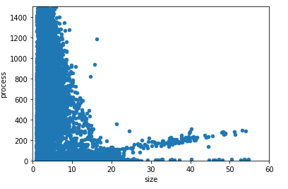
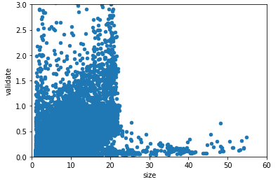
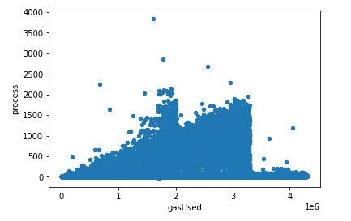
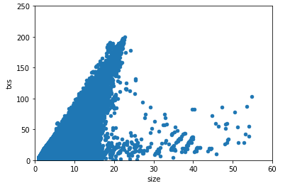

Random findings on syncing an Ethereum node using go-ethereum.
# Run Notebook
`pip install -r requirements.txt`
`source env/bin/activate`
`juypter lab`

# Full Node Sync Validation

During a full node sync, there is overhead that comes with processing, validating, and updating state. The goal of this analysis is to find bottlenecks that may influence the development of Quai. Below we have outlined the metho calls that lead up to the `insertChain` method in `core/blockchain.go` that handles the majority of the processing and inserting during syncing with a peer.


### `eth/downloader/downloader.go`
`synchronise`
- Calls `syncWithPeer`.

`syncWithPeer`
- Starts a block synchronization based on the hash chain from the specified peer and head hash.
- Creates the fetchers for getting headers, bodies, and receipts.
- Creates the fetchers for processing headers and the full sync context.
- Runs `spawnSync()` for all fetchers in seperate go routines.

`processFullSyncContent()`
- Takes fetch results from the queue and imports them into the chain.
- Calls `importBlockResults`.

`importBlockResults()`
- Retrieve the batch of results to import.
- Makes block types out of the given header data:
````go
    for i, result := range results {
        blocks[i] = types.NewBlockWithHeader(result.Header).WithBody(result.Transactions, result.Uncles)
    }
````
- Calls `InsertChain` for each block made.

### `core/blockchain.go`
`insertChain`
- Starts a parallel signature recovery (signer will fluke on fork transition, minimal perf loss).
- Process block using the parent state as reference point.

The three metrics being timed in this analysis of `insertChain`:
- `Process` processes the state changes according to the Ethereum rules by running the transaction messages using the statedb and applying any rewards to both the processor (coinbase) and any included uncles. Process returns the receipts and logs accumulated during the process and returns the amount of gas that was used in the process. If any of the transactions failed to execute due to insufficient gas it will return an error.
````go
receipts, logs, usedGas, err := bc.processor.Process(block, statedb, bc.vmConfig)
if err != nil {
    bc.reportBlock(block, receipts, err)
    atomic.StoreUint32(&followupInterrupt, 1)
    return it.index, err
}
````

- `ValidateState` validates the various changes that happen after a state transition, such as amount of used gas, the receipt roots and the state root itself. ValidateState returns a database batch if the validation was a success otherwise nil and an error is returned.
````go
if err := bc.validator.ValidateState(block, statedb, receipts, usedGas); err != nil {
    bc.reportBlock(block, receipts, err)
    atomic.StoreUint32(&followupInterrupt, 1)
    return it.index, err
}
````

- `writeBlockWithState` writes the block and all associated state to the database, but is expects the chain mutex to be held.
````go
status, err := bc.writeBlockWithState(block, receipts, logs, statedb, false)
atomic.StoreUint32(&followupInterrupt, 1)
if err != nil {
    return it.index, err
}
````


### Size vs. Process Time
During the step to process a given block and apply it's transactions, we see a resemebalance to a Poisson distribution and a smaller linear uptrend.

The Poisson distribution is defined by the following and in this case carries a  λ = ~1:


If we focus on the linear uptrend we see a slope of roughly:
- `y = 5x`



### Size vs. Validate Time
The process to validate state includes:
- Getting the block header and calculating gas used.
- Validating the received block's bloom with the one derived from the generated receipts.
- Checking the receipt Trie's root against the given receipts.
- Getting the intermediate state root and calculating it against the received state root (after already applying txs)

It seems there is a rough max linear threshold starting around y = .75 that trends at:
- `y = 0.0425x + 0.75`



### Size vs Writing Block with State
Here we have a Poisson distrubtion.


### Process vs. Gas Used

The process time compared to gas usage is linear in time with an approximate formula of:
- `y = 500x` 



### Size vs. # of Transactions
There is also a direct linear correlation of size to txs that results in:
- `y = 9.5x`


